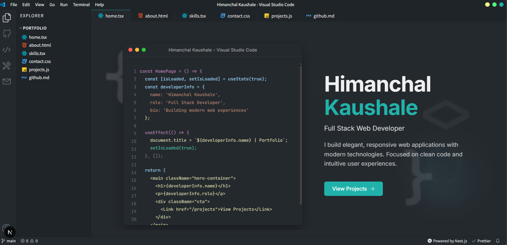

# Himanchal Kaushale - Portfolio

A modern, VS Code-themed developer portfolio built with Next.js, featuring interactive UI elements, typing animations, and a responsive design.




## ✨ Features

### 🎨 Interactive UI
- **VS Code Theme**: Authentic VS Code interface with macOS-style window controls
- **Typing Animation**: Dynamic letter-by-letter name animation on the homepage
- **Neon Glow Effects**: Beautiful hover effects on skill cards with cyan neon borders
- **Smooth Transitions**: Polished animations throughout the interface

### 📱 Responsive Design
- **Mobile-First**: Fully optimized for all screen sizes
- **Touch-Friendly**: Enlarged sidebar buttons for mobile devices
- **Adaptive Layout**: Skill cards and project cards adjust seamlessly to viewport

### 🛠️ Skills Showcase
- **Colorful Tech Icons**: Tech stack displayed with official brand-colored icons
- **3-Column Layout**: Clean grid layout for skill categories (desktop)
- **Icon Integration**: Uses `react-icons` for comprehensive icon library
- **Interactive Cards**: Hover effects with neon glow and elevation

### 💼 Projects Section
- **Streamlined Display**: Clean project cards without external links
- **Technology Tags**: Shows tech stack for each project
- **Responsive Grid**: Adapts from 3 columns to single column on mobile

### 🧭 Navigation
- **Sidebar Navigation**: Quick access icons for all major sections
- **Explorer Panel**: File-tree style navigation with section links
- **Tab Bar**: Active tab indication with file icons
- **Skills Tab**: Dedicated section for technical expertise

### 🎯 Page Sections
- **Home**: Animated introduction with code editor display
- **About**: Personal information and background
- **Skills**: Technical expertise organized by category
  - Full Stack Web Development
  - DevOps & Automation
  - GenAI & LLM
- **Projects**: Portfolio of work and achievements
- **Contact**: Get in touch form with social links
- **GitHub**: GitHub profile integration

## 🚀 Getting Started

### Prerequisites
- Node.js 16.x or higher
- npm or yarn

### Installation

1. Clone the repository
```bash
git clone https://github.com/himanchalkaushale/My_Portfolio_Page.git
cd My_Portfolio_Page
```

2. Install dependencies
```bash
npm install
# or
yarn install
```

3. Run the development server
```bash
npm run dev
# or
yarn dev
```

4. Open [http://localhost:3000](http://localhost:3000) in your browser

## 🎨 Customization

### Personal Information
Update your details in:
- `components/Titlebar.tsx` - Portfolio name in titlebar
- `pages/index.tsx` - Homepage name and introduction
- `components/ContactForm.tsx` - Contact information and social links

### Skills
Edit `data/skills.ts` to update:
- Skill categories and descriptions
- Tech stack for each category
- Icons (choose from `react-icons`)

### Projects
Modify `data/projects.ts` to add/edit:
- Project titles and descriptions
- Technologies used
- Project details

### Styling
- `styles/HomePage.module.css` - Homepage styling and animations
- `styles/SkillCard.module.css` - Skill card styling and hover effects
- `styles/SkillsPage.module.css` - Skills page layout
- `styles/Sidebar.module.css` - Sidebar navigation styling

## 🛠️ Tech Stack

- **Framework**: Next.js 14
- **Language**: TypeScript
- **Styling**: CSS Modules
- **Icons**: React Icons
- **Deployment**: Vercel (recommended)

## 📦 Project Structure

```
vscode-portfolio-main/
├── components/          # React components
│   ├── ContactForm.tsx
│   ├── Explorer.tsx
│   ├── ProjectCard.tsx
│   ├── Sidebar.tsx
│   ├── SkillCard.tsx
│   ├── Tabsbar.tsx
│   └── Titlebar.tsx
├── data/               # Data files
│   ├── projects.ts
│   └── skills.ts
├── pages/              # Next.js pages
│   ├── index.tsx      # Homepage
│   ├── about.tsx
│   ├── contact.tsx
│   ├── github.tsx
│   ├── projects.tsx
│   └── skills.tsx
├── styles/             # CSS modules
└── public/             # Static assets
```

## 🌟 Key Features Implemented

- ✅ Custom typing animation with blinking cursor
- ✅ macOS-style window controls with title bar
- ✅ Neon glow hover effects on cards
- ✅ Colorful tech stack icons with brand colors
- ✅ Fully responsive mobile design
- ✅ Skills page with 3-column layout
- ✅ Removed settings page for cleaner navigation
- ✅ Touch-friendly mobile sidebar buttons
- ✅ Optimized viewport handling for mobile
- ✅ Clean commit history with semantic commits

## 🚀 Deployment

### Deploy to Vercel

1. Push your code to GitHub
2. Import your repository on [Vercel](https://vercel.com)
3. Vercel will auto-detect Next.js and deploy

```bash
# Quick deploy
npx vercel
```

### Environment Variables
No environment variables required for basic functionality.

## 📝 License

This project is open source and available under the MIT License.

## 👨‍💻 Author

**Himanchal Kaushale**
- GitHub: [@himanchalkaushale](https://github.com/himanchalkaushale)
- Email: himanchal.kaushale@gmail.com
- Portfolio: [My Portfolio Page](https://github.com/himanchalkaushale/My_Portfolio_Page)

## 🙏 Acknowledgments

- Original VS Code theme inspiration from the developer community
- Icons from [React Icons](https://react-icons.github.io/react-icons/)
- Built with [Next.js](https://nextjs.org/)

---

⭐ Star this repo if you found it helpful!
